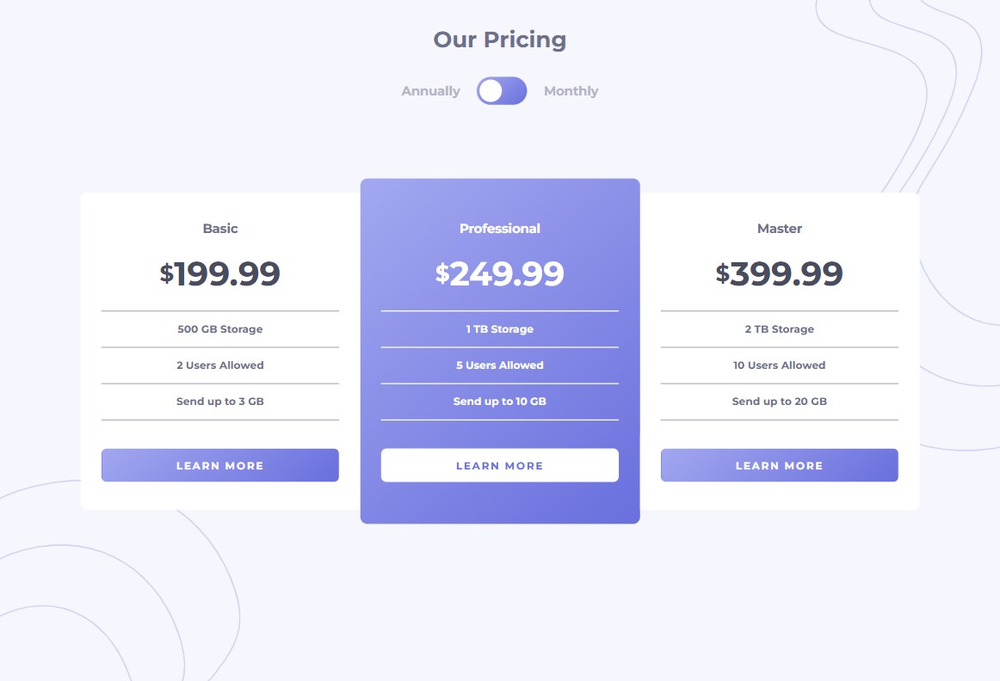

# Frontend Mentor - Pricing component with toggle solution

This is a solution to the [Pricing component with toggle challenge on Frontend Mentor](https://www.frontendmentor.io/challenges/pricing-component-with-toggle-8vPwRMIC). Frontend Mentor challenges help you improve your coding skills by building realistic projects. 

## Table of contents

- [Overview](#overview)
  - [The challenge](#the-challenge)
  - [Screenshot](#screenshot)
  - [Links](#links)
- [My process](#my-process)
  - [Built with](#built-with)
  - [What I learned](#what-i-learned)
  - [Continued development](#continued-development)
- [Author](#author)

## Overview

### The challenge

Users should be able to:

- View the optimal layout for the component depending on their device's screen size
- Control the toggle with both their mouse/trackpad and their keyboard

### Screenshot




### Links

- Solution URL: (https://github.com/NatashaShcherbak/frontendmentor.git)

## My process

### Built with

- Semantic HTML5 markup
- CSS custom properties
- Flexbox
- Mobile-first workflow
- JS


### What I learned

```css - This is the first time I've made a switch like this.
.price__term-switch::before {
    content: "";
    background-color: var(--white);
    width: 32px;
    height: 32px;
    border-radius: 50%;
    position: absolute;
    top: 4px;
    left: 4px;
}
```
```js - I've never used the "keyup" event for Enter before.
label.addEventListener("keyup", event => {
	if(event.code === 'Enter') {
		checked();
	}
});
```


### Continued development

In the future, I want to use Javascript and React more, write more features and capabilities for users.


## Author

- Frontend Mentor - [@NatashaShcherbak](https://www.frontendmentor.io/profile/NatashaShcherbak)

